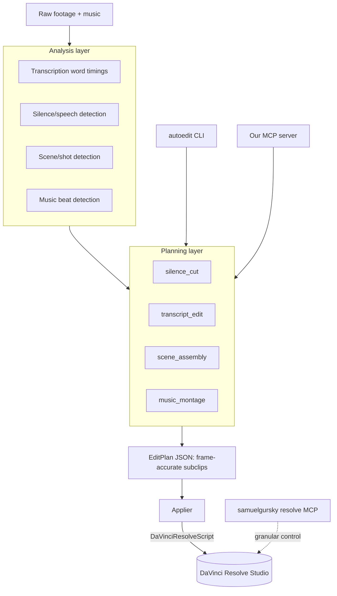

# Auto Edit Engine for DaVinci Resolve

> **Status:** Core engine is implemented (Story / Assemble / Montage, UI, CLI, MCP). Prefer [README.md](../README.md), [SETUP.md](SETUP.md), and [STORYBOARD.md](STORYBOARD.md) for current behavior. This document remains useful as the original architecture brief; the “Implementation todos” below are largely done.

**Overview:** Build a Python auto-edit engine (silence removal, transcript editing, scene assembly, music montage) that analyzes footage, produces a frame-accurate EditPlan, and applies it to DaVinci Resolve Studio. Reuse [samuelgursky/davinci-resolve-mcp](https://github.com/samuelgursky/davinci-resolve-mcp) for Resolve control; expose our engine as both a CLI and its own MCP server.

## Implementation todos

1. Scaffold Python package (`pyproject.toml`, `requirements.txt`, `.env.example`, `src/autoedit` layout, README, `docs/SETUP.md`).
2. `config.py` + `resolve_client.py`: connect via `DaVinciResolveScript`, project/media pool, import media, create timelines.
3. `models.py`: `EditPlan` / `ClipSegment` dataclasses with JSON (de)serialization and frame math helpers.
4. `applier.py`: EditPlan → Resolve timeline via positioned `AppendToTimeline` + markers + music track.
5. Analyzers: transcription (faster-whisper), silence (ffmpeg `silencedetect`), scenes (PySceneDetect), beats (librosa).
6. Planners: `silence_cut`, `transcript_edit`, `scene_assembly`, `music_montage` → EditPlans.
7. Typer CLI: `autoedit silence|transcript|scenes|montage` plus preview/apply.
8. FastMCP server: `analyze_media`, `plan_*`, `preview_plan`, `apply_plan`; register alongside samuelgursky MCP.
9. Unit tests for analyzers/planners frame math; document manual Resolve smoke test.

## Goal

A scriptable engine that turns raw footage + music into an assembled Resolve timeline, supporting four edit modes. Usable via a one-command CLI and via MCP tools. Reuses an existing Resolve MCP for low-level control; we build the brain that decides the cuts.

## Architecture

Core idea: every mode produces a normalized `EditPlan` (list of subclips with source `startFrame`/`endFrame`, `trackIndex`, `recordFrame`, markers, plus an optional music track). One `Applier` renders any plan into a Resolve timeline via `MediaPool.AppendToTimeline([{clipInfo}, ...])`. Modes stay decoupled; edits are deterministic and previewable as JSON before touching Resolve.

## Prerequisites

See [SETUP.md](SETUP.md). Summary:

- DaVinci Resolve Studio running; Preferences → System → General → External scripting using = **Local**.
- macOS env: `RESOLVE_SCRIPT_API`, `RESOLVE_SCRIPT_LIB`, `PYTHONPATH` → Resolve Scripting `Modules/`.
- Python 3.10–3.12, `ffmpeg` on PATH.

## Reused component

Install and register `davinci-resolve-mcp` (samuelgursky) for granular Resolve control (`media_pool(action="append_to_timeline", ...)`, timeline/marker/render tools). Our engine uses the same underlying API directly for batch, frame-accurate applies.

## Project layout

- `src/autoedit/config.py` — env, Resolve connect, fps helpers
- `src/autoedit/resolve_client.py` — thin `DaVinciResolveScript` wrapper
- `src/autoedit/models.py` — `EditPlan`, `ClipSegment` + JSON
- `src/autoedit/analyzers/` — `transcription.py`, `silence.py`, `scenes.py`, `beats.py`
- `src/autoedit/planners/` — `silence_cut.py`, `transcript_edit.py`, `scene_assembly.py`, `music_montage.py`
- `src/autoedit/applier.py` — EditPlan → timeline
- `src/autoedit/cli.py` — typer CLI
- `src/autoedit/mcp_server.py` — FastMCP tools
- `pyproject.toml`, `requirements.txt`, `.env.example`, `tests/`

## Edit modes

- **Silence removal:** detect speech, keep segments, ripple as subclips (padding / min-gap) for jump cuts.
- **Transcript editing:** word-timed transcript; delete text or keyword filter → map back to cuts.
- **Scene assembly:** PySceneDetect shots, order/select by length heuristics, rough cut + marker per scene.
- **Music montage:** librosa beats, cut b-roll on beats, music on audio track from frame 0.

## Dependencies

`faster-whisper`, `scenedetect[opencv]`, `librosa`, `soundfile`, `numpy`, `typer`, `fastmcp`, `python-dotenv` (+ system `ffmpeg`, Resolve's `DaVinciResolveScript`).

## Validation

- Unit-test analyzers/planners on tiny fixtures (no Resolve) asserting EditPlan frame math.
- Manual smoke: each CLI mode with Resolve open; confirm timeline and frame-accurate cuts.

## Defaults

- Frame math is source of truth (seconds → frames via clip fps).
- Plans are JSON-inspectable before apply.
- macOS first; Whisper default small/base for speed, configurable.
